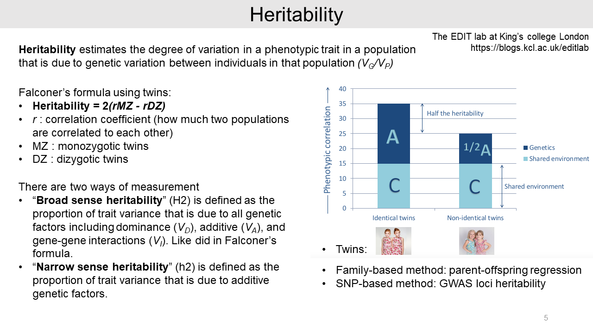
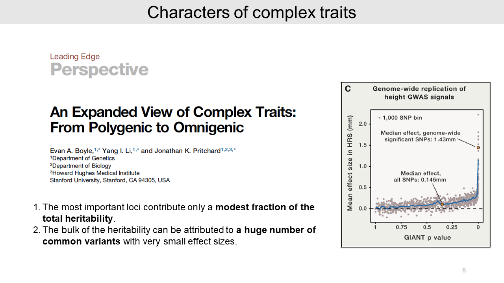

[Home](https://kisudsoe.github.io)

`2019-08-01` First posted

[TOC]

# Omnigenic inheritance

Here, I will introduce two serial papers written by Dr. Pritchard's for **'Omnigenic inheritance'**[^1],[^2]. Previously in 2017, Dr. Prichard suggested an omnigenic model for a typical complex trait. This idea is advanced from Sir Fisher's polygenic inheritance for quantitative traits, named as **'infinitesimal model'** in 1918. In this paper, based on the omnigenic model, the authors tried to explain more advanced attributes such as *cis* and *trans* effects, and concluded that many small *trans* effects contribute most of the trait heritability.

[^1]: Boyle et al., 2017, Cell, http://www.doi.org/10.1016/j.cell.2017.05.038
[^2]: Liu et al., 2019, Cell, http://www.doi.org/10.1016/j.cell.2019.04.014

## 1. Quantitative traits

### 1-1. Fisher's infinitesimal model

In 1918, Sir Fisher tried to explain polygenic inheritance for quantitative traits. He hypothesized that the quantitative trait will be normally distributed and the allele effect is additive.

For example, the combination of 2 genotypes in 3 different genes yields 27 genotypes and 7 phenotypes that approaches the normal distribution in the population. If the numbers of contributed genes are infinitely increased, the phenotype becomes a quantitative trait. This idea is named as an **'infinitesimal model'**.

### 1-2. Model of quantitative genetics

In quantitative genetics point of view, Sir Fisher's model has multiple compartments for phenotypic variance *P*, including genetic factors *G*, non-genetic environmental factor *E*, and interaction effects between genetic and environmental factors (*G x E*).

The genetic factors *G* have three attributes, including additive, dominance, and epistasis. Most of the genetic factors are additive. This model introduced the concept of heritability which is a summary of a trait variation.

### 1-3. Heritability and missing heritability

Heritability is a measure of similarity within families. For example, Falconer's formula for heritability is calculated from the phenotypic correlations of monozygotic twins and dizygotic twins.

This is **broad-sense heritability**, which includes all genetic factors such as dominance, additive, and gene-gene interactions. On the other hand, **narrow-sense heritability** is only considering additive genetic factors.

In addition, there are several ways to estimate heritability such as family-based method and SNP-based method.

From GWAS data, all the significant hits explained only a small proportion of the risk heritability. For example, 18 genetic loci of type 2 diabetes only have 6% of the expected heritability and 40 loci of height explained just 5% of the expected heritability[^3].

[^3]: Manolio et al., 2009, Nature, https://doi.org/10.1038/nature08494

We call this the **"missing heritability"** problem, which caused by a large number of small-effect common variants that are not significant.

The small-effect common variants tend to be spread across the whole genome area. For example, schizophrenia colored as a red region showed that over 71% of the genome region contributes to the total heritability.

### 1-4. Attributes of complex traits

In 2017 paper[^1], the authors reported some attributes of complex traits:

- First, the significant genetic variants for traits provide only a modest proportion of the total heritability.
- Second, a huge number of small-effect common variants contribute to the heritability. On the other hand, generally, rare variants are not major contributors.

- Third, the relevant functions of genes contribute only slightly more to the heritability than random genes. For example, there are immune functions for Crohn's disease and Rheumatoid arthritis, and neuronal functions such as ion channels for Schizophrenia.

- And authors found that genes expressed in relevant cell types contribute significantly to the heritability. As an example, the schizophrenia heritability is significantly contributed from both broadly expressed genes and genes expressed in relevant cell type (in this case, Frontal Cortex).

- Forth, authors reported that many regulatory elements and genes contribute heritability of a typical complex trait.

- Lastly, SNPs in active chromatin regions are significantly enriched and noncoding variants are generally dominated in the heritability of complex traits. However, protein-coding variants are relatively rare in the genome and thus they provide only a small proportion of heritability.

## 2. Omnigenic model

### 2-1. Summary of omnigenic model

This is the summarized key points of the omnigenic model that consists of core genes and peripheral genes. The **core genes** can directly affect disease risk. But **peripheral genes** can indirectly affect risk by trans-regulatory effects on core genes.

The omnigenic model suggested two key proposals. First, **most of the genes expressed in trait-relevant cells** could regulate core genes. And second, most of the heritability is contributed by **variations near peripheral genes**.

From the omnigenic model, we can ask these three questions:

1. Why does such a large portion of the genome contribute to heritability?
2. Why do the lead hits for a typical trait contribute so little to heritability?
3. What factors determine the effect sizes of SNPs on traits?

To find the answers, authors apply the ***cis* and *trans*-regulatory effects** to the omnigenic model.

### 2-2. A quantitative phenotype model

Authors generated a quantitative phenotype model with the simplest relationship between phenotype value *Y* and core gene expression. In this model, the expression level of each core gene affects linearly to the phenotype value *Y* with a slope *gamma-j*.

The peripheral genes can affect phenotype value indirectly by modifying the core gene expressions as *trans*-QTLs. Because peripheral genes do not have a direct effect on the phenotype, the slope value equals zero.

From the previous formula, the heritability of phenotype variance consists of the direct effects, covariance effects, and non-genetic effects. The direct effects cumulatively contribute to the phenotype by the core gene expression changes. And the covariance effects are additive between two core gene pair; gene j and k.

### 2-3. *Cis* and *trans* contributions to heritability

From this model, the genetic variance can affect core genes through *cis* and *trans* regulations. The equation for this relationship is shown in this slide. The phenotypic variance *Var(Y)* consists of M numbers of *cis* effects, M numbers of *trans* effects, M^2^-M numbers of covariance effects, and non-genetic variance.

Then, the authors measured the relative importance of *cis* versus *trans* effects on the heritability of gene expression from several GWASs. Results in different studies using human and model organisms consistently show that 60~90% of heritability came from *trans* effects of genetic variance.

These studies assume that QTLs within a pre-specified physical distance of the target gene, such as 1 Mb, act as *cis*-regulatory variants, and all other act in *trans*.

And the authors calculated and displayed *cis* and *trans*-eQTL effect sizes as the absolute Z score by using 913 human blood sample data. The *trans*-eQTL have mostly small effect sizes compared to *cis* effects. Because small sizes of the *trans*-eQTL in humans, finding them are notoriously difficult.

And it is hard to estimate how many *trans*-eQTLs mediate to a typical gene. Since about 70% of the expression heritability is in *trans*, typical genes must have very large numbers of weak *trans*-eQTLs. This may be a reason why most of the genome contributes heritability for typical traits.

### 2-4. Models for covariance effects

So, in this equation, most of the trait heritability is mediated by *trans*-eQTLs to core gene expression. However, we have limited knowledge about the covariance effect. It is possible that the sum of the covariance effects of two core genes could be almost zero or substantially positive value.

It seems less biologically relevant that the sum of covariance effects is substantially negative, which means most of the gene pairs are anti-correlated.

We can assume two different models by the covariance effect values.

- In model 1, core genes generally not co-regulated. The gene pair effect is almost zero and we can ignore the covariance effect here. Then simply the trait heritability would consist of 30% *cis*-eQTLs and 70% *trans*-eQTLs.
- In model 2, core genes generally co-regulated. In this model, the sum of the covariance effect is substantially positive. Because the numbers of core gene pairs are very large and this effect is driven by trans regulation, this covariance effect can dominate for trait *Y*.

So, *trans*-eQTLs could affect multiple core genes and act as strong amplifiers in co-regulated gene networks.

For example, in 2017 Dr. Lukowski identified 15,000 gene pairs with genetic covariance from human blood data. Most of the *trans* effects are derived from genetic covariances. And this result also indicates that many more gene pairs are not significant.

Authors suggested that transcription factors tend to drive directional effects on many target genes. Thus, a single variant for transcription factor may cause substantial covariance effect on disease risk.

## 3. SNP effect sizes on disease risk

### 3-1. *cis* and *trans* effects

Authors estimated the SNP effect sizes on disease risk. If we supposed that one eQTL and one core gene relationship, the effect size for phenotype is the alpha multiplied with the gamma. The alpha is the effect size of a SNP on the expression of gene. The gamma is a unit of the direct effect on the expression of core gene.

As aforementioned, *trans*-eQTLs likely have very small effect size compared to a *cis*-eQTL.

### 3-2. Many weak *trans* effects

Expanding the logic to multiple core genes, the effect size of a trans-eQTL is a sum of effects on downstream core genes. The equation is shown in this slide.

In the case of model 1 with the independent effects on core genes, the effect size is expected as zero. As aforementioned, the heritability of a typical complex trait is driven by many weak *trans* effects.

In the case of model 2, any correlations in core gene pairs further increase the variance of effect sizes.

As an example, peripheral master regulators such as transcription factors could be important to the typical traits. From previous GWASs, KLF14 in diabetes and IRX3/5 at the FTO locus in obesity drive covariance effects on many downstream target core genes.

In this case, an SNP effect size may potentially add up a relatively large effect. And a recent study also suggested that many transcription factor-disease pairs showed persistent directional effects on disease risk.

## 4. Pleiotropy

Lastly, it is possible that an eQTL can affect multiple traits as pleiotropy. We can suppose that the two traits have independent core genes as model 1.

In this case, there is no genetic covariance effect and the variant may affect both traits in a sporadic fashion. And effect size consist of many weak effects.

In model 2, we can assume that the two traits have either share core genes or share co-regulated networks. In this case, the two traits can have co-effects of SNP with share genetic covariance. The equation for this situation is shown this slide.

For example, psychiatric diseases are driven by overlapping genes or co-regulated networks. And FTO variant is another good example for the pleiotropy.

## 5. Conclusion

For next steps, the biggest current gap of knowledge is absent of *trans*-regulatory map. Because of the small effect sizes, the *trans*-eQTL mapping requires extremely large sample sizes. Recently some human studies using whole blood have started an extremely large sample size.

Identifying rare variants may help to find critical genes that are protected from common variations. To identify rare variants with large effects, deep sequencing and the large sample size are needed.

And there are two existing methods to combine GWAS and eQTL including PrediXcan and TWAS. These methods use *cis*-eQTLs to identify genes in causal pathways of a certain disease.