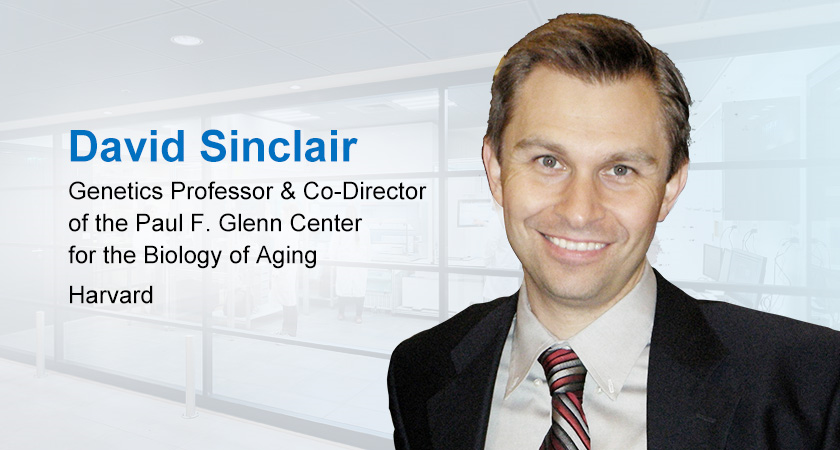
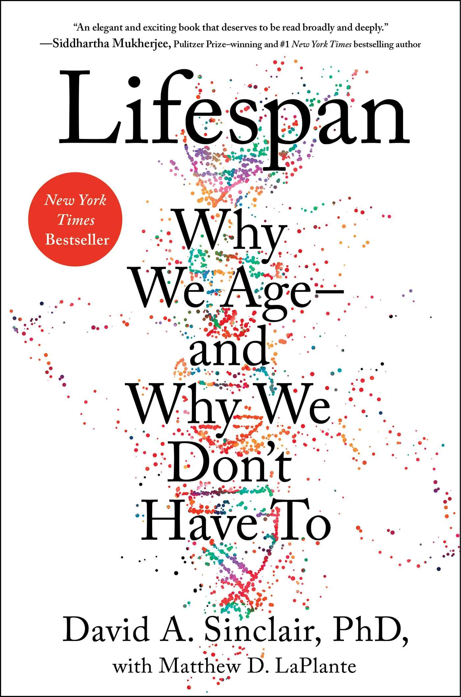
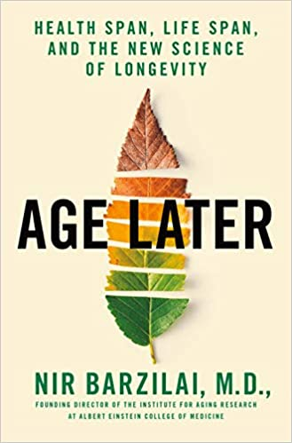

# Stories of Aging and longevity 

8/22/2020
Columbia University Irving Medical Center

Seungsoo Kim, Ph.D.

---

# Life style changes by Covid-19 (1)

- Biomedical science, 유전학, 노화 분야 소개
- Bioinformatics 소개
- New York, 코로나 때 분위기? [nytimes 그래프 찾기]
  - March - quaruntine start
  - June - self-return
  - July - partial reopen
  - August - reopen

---

# Life style changes by Covid-19 (2)

전문분야 어떤변화?
- clinic 변화: virtual diagnosis
- 랩 생활 변화: 연구방식의 변화?, virtual meeting
- 지도교수님 traveling 변화
- 학회 형식 변화
- 연구자들 간 collaboration 형식 변화
연구분야 뉴노말?
궁금한거?

---

|  |  |
|--|--|
|  |  |

---

# David Sinclair - Lifespan

* 

---

# Nir Barzilai - Age Later

* 

---

# Ideas (1) - 철학적 문제들

시작 질문 - 내가 알고있는 생물학 전문용어?
과학자는 상상하는 사람 - 내가 SF영화를 사랑하는 이유
과학의 가설 - 오컴의 면도날
생명체의 정의, 노화의 정의 - Biology 101
Aging Biology - 노화 가설 소개, Geroscience hypothesis 소개
노화 연구1 - 20세기 유사과학으로 치부되던 시절에는...
패러독스1, 후손이냐 장수냐, 에너지의 배분
노화는 외력(스트레스)과 내력(세포방어 체계)의 싸움 - 나의 아저씨
패러독스2, 내가 나인가? - 테세우스의 배, 공각기동대

---

# Ideas (2) - 과학적 증거들

* 시스템 생물학 소개 및 노화의 현상들
* 노화와 질병 - 생쥐 실험들
* 식이와 장수 - 실험 모델의 결과
* 현재 알려진 장수 메커니즘(동물모델) - 돌연변이체, 식이요법, 약물실험
* 최강의 장수 생물 - 곰벌레
* 다시 노화의 정의, 노화연구의 어려움과 복잡성
* 장수의 요소 - 줄기세포와 텔로미어, DNA repair, ...

---

# Ideas (3) - 구체적 예시들?

Calico - 구글 프로젝트
  https://biz.chosun.com/site/data/html_dir/2016/12/25/2016122501339.html
  http://www.hmhtimes.com/news/articleView.html?idxno=2981
Biosphere
Calerie.duke.edu
남자의 노화, 여자의 노화 - 동물 모델은 모두 남자, 성 호르몬의 득과 실

---

# Ideas (4) - 미래 전망

빅데이터의 시대 - 과학계의 변화1
자율주행 인공지능 시대 - 과학계의 변화2
노화연구2 - 현대 빅데이터, AI 시대의 연구 경향
약을 넘어선 치료제들 - 호르몬(단백질) 치료제, 세포 치료제, ...
불노장생의 약이 먼저 나올까, 탈모 치료제가 먼저 나올까?

---

# Ideas (5) - 기타 주제들

세포의 의사결정 시스템?
이스라엘 10th Man 열 번째 사람 - 영화 월드워Z, 의견의 다양성
생명윤리와 인간연구 - 황우석 사태, 신라젠 사태 등